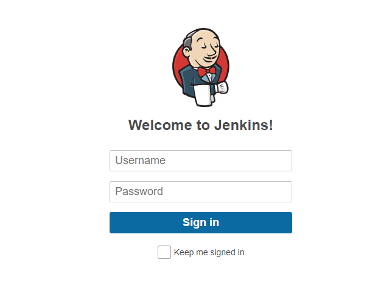
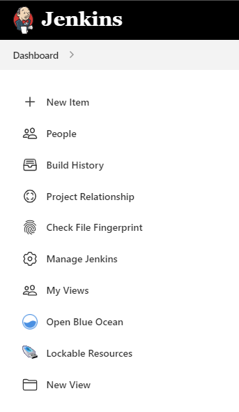
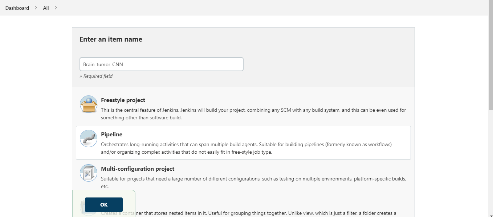
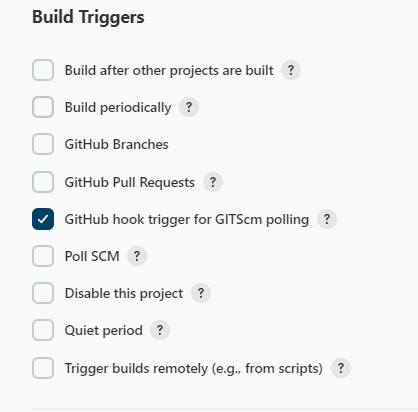
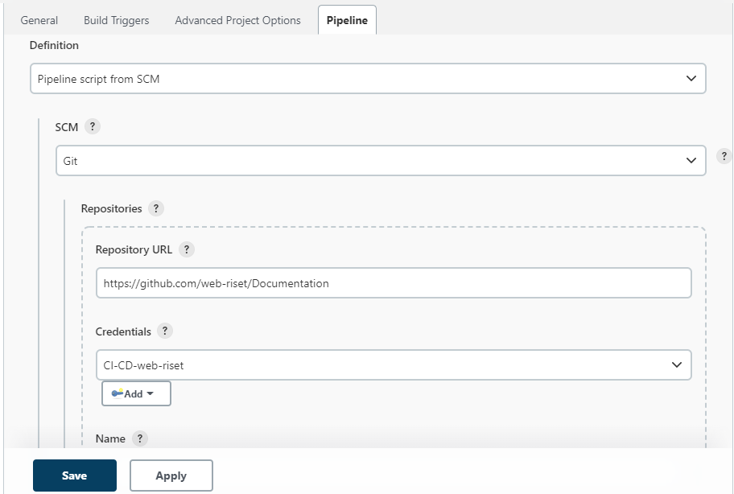

<!-- omit in toc -->
This Documentation For Administrator
=========================

Clone this repository to your local machine and try dockerize your app using [Docker](https://www.docker.com/)

<!-- omit in toc -->

<h1>📜 Table of Contents</h1>

- [Jenkins](#jenkins)
  - [Sign in Jenkins](#sign-in-jenkins)
  - [Create New Pipeline](#create-new-pipeline)

# Jenkins
## Sign in Jenkins

Go to this [site][jenkins-url] and sign in with your username and password

(<a href="#top">back to top</a>)

## Create New Pipeline

Click on `New Item` at Navigation Bar

Input the name based on the name of the repository on [github web-riset][github-web-riset] and then click ok

example:

For `Build Triggers` Mark on `GitHub hook trigger for GITScm polling`. this will make pipeline build base on webhook event

And for pipeline configuration, choose `Pipeline script from SCM`, because `Jenkinsfile` will be on the repository.

For the SCM, choose `Git` and you can use `CI-CD-web-riset` credentials for connect to github application. and last, you can fill `Repository URL` with github repository that you want to build. this is the example:

And make sure you have an existing branch in your github repository. for this repository, pipeline will only build from `main` branch. 

And you can save this pipeline, and don't forget to `build` this for the first time, to make sure the pipeline work as expected

[jenkins-url]: https://a08a-202-52-52-14.ngrok.io/
[github-web-riset]: https://github.com/web-riset/